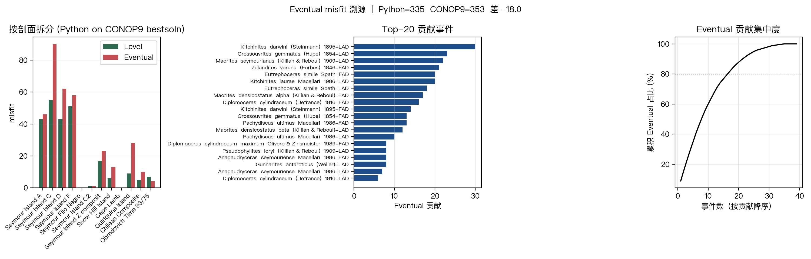

# CONOP9代价函数的Python跨解复现与Eventual偏差诊断

**作者**：杜鑫宇  
**单位**：南京大学地球科学与工程学院，江苏 南京 210023

**摘要**：CONOP9 将多剖面化石首现、末现和标志层资料转化为复合地层序列优化问题，是定量地层对比的重要工具，但其 Windows 二进制和封闭实现限制了自动化验证与误差追踪。围绕南极 Seymour Island 白垩纪-古近纪菊石数据，基于仓库中的 Python 复现代码和 21 组已归档 CONOP9 解，对 Ordinal、Level 和 Eventual 三类 penalty 进行跨解校验。验证脚本从每组 `outmain.txt` 提取 CONOP9 penalty，以相应 `bestsoln.dat` 为输入重新计算 Python penalty。结果显示，Ordinal 和 Level 在 21 个解上均与 CONOP9 完全一致，平均绝对误差为 0；Eventual 在 21 个解上均系统性偏低，平均低 33.76，最大低 83。单一 `bestsoln.dat` 上的 18 分差异不能再解释为偶发误差，而应视为 Eventual 计数规则仍未完全复现。该结果表明，Python 代码已经可靠复现 CONOP9 的顺序约束和 level 延限惩罚，同时也明确限定了 Eventual 相关结论的适用范围。

**关键词**：CONOP；代价函数；Python复现；跨解验证；Eventual penalty；保序回归

**中图分类号**：P539；TP311.1  
**文献标识码**：A

## Python Cross-Solution Validation of CONOP9 Penalty Functions and Diagnosis of Eventual Bias

**Abstract**: CONOP9 formulates multi-section stratigraphic correlation as an optimization problem over a composite sequence of first appearances, last appearances and marker events. Its closed Windows binary, however, makes automated validation and error tracing difficult. This study evaluates a Python reimplementation of CONOP penalty functions on the Seymour Island Cretaceous-Paleogene ammonite dataset. Instead of validating against a single reference solution, 21 archived CONOP9 runs were used as cross-solution test cases. For each run, the reference penalties were extracted from `outmain.txt`, and the corresponding `bestsoln.dat` was evaluated independently in Python. The Ordinal and Level penalties matched CONOP9 exactly for all 21 solutions, with zero mean absolute error. The Eventual penalty did not match any solution and was consistently lower than CONOP9, with a mean bias of -33.76 and a maximum absolute difference of 83. These results support the correctness of the Python implementation for order and level-extension penalties, but show that Eventual remains a partially reproduced objective whose counting rule requires further diagnosis.

**Key words**: CONOP; penalty function; Python reimplementation; cross-solution validation; Eventual penalty; isotonic regression

## 1 引言

定量地层对比的核心困难在于，多剖面化石记录通常存在保存不完备、采样不足和穿时现象。CONOP 将该问题抽象为全局事件排列问题：所有 taxon 的 FAD、LAD 以及年龄或岩性 marker 被放入一个复合序列中，优化算法寻找与各剖面局部观测冲突最小的排列。Sadler 和 Cooper（2008）将这种方法用于提升传统生物地层分带的分辨率，Sadler 等（2009）进一步展示了大规模 graptolite 数据构建高分辨率时间标尺的应用价值。

课程项目原始工作使用 CONOP9 二进制程序完成参数扫描，并在 Python 中复现输入解析、代价函数和模拟退火流程。仅能运行原程序并得到一个 best fit，不足以回答代价来自哪里、某个解是否可重复、以及目标函数能否被替换等问题。因此，代码探索的关键不在于写出另一个优化器，而在于确认 Python 计算出的 penalty 是否真正等价于 CONOP9。

原论文草稿只在一个 `bestsoln.dat` 上比较 3 个数字：Ordinal 367、Level 237、Eventual 335 对 353。这种单点校验容易被质疑为对一个 benchmark 过拟合。本研究改用仓库中已经归档的 21 组 CONOP9 解做跨解验证，检验 Python penalty 是否能在不同参数、不同随机重复产生的解上稳定复现 CONOP9 输出。

## 2 数据与验证设计

### 2.1 数据集

研究对象为南极 Seymour Island 白垩纪-古近纪菊石地层对比数据。输入文件位于 `CONOP-run/`，包括 `sections.txt`、`events.txt`、`loadfile.dat` 和 CONOP9 输出的 `bestsoln.dat`、`outmain.txt`。Python 解析后得到 12 个剖面、49 个 taxon、若干 AGE/ASH marker，以及 120 个复合事件。FAD 和 LAD 是主要生物事件，AGE/ASH 主要作为固定或锚定事件参与约束。

**表1 数据与结果来源 / Data and result sources**

| 内容 | 文件或目录 | 用途 |
|---|---|---|
| 剖面列表 | `CONOP-run/sections.txt` | 剖面编号与名称 |
| 事件定义 | `CONOP-run/events.txt` | taxon、FAD/LAD、AGE/ASH marker |
| 局部观测 | `CONOP-run/loadfile.dat` | 每个剖面中事件的观测层位 |
| CONOP9 解 | `results/*/run_*/bestsoln.dat` | 复合序列排列 |
| CONOP9 penalty | `results/*/run_*/outmain.txt` | Ordinal、Level、Eventual 参考值 |
| Python 验证脚本 | `scripts/validate_conop9_penalties.py` | 批量重算并输出误差表 |

### 2.2 跨解验证方案

验证集不是单个最优解，而是 `results/` 中 7 组参数、每组 3 次重复，共 21 个 CONOP9 归档运行。每个运行目录同时包含 `bestsoln.dat` 和 `outmain.txt`，因此可以把 CONOP9 输出视为参考值，把 Python 代码作为独立计算器重新评估同一排列。

具体流程为：

1. 用 `parse_loadfile()` 读取局部观测，并用 `build_section_observations()` 按剖面分组。
2. 对每个 `results/<tag>/run_<n>/bestsoln.dat`，用 `solution_to_sequence()` 得到复合事件序列。
3. 构建 `ConopContext`，分别计算 `ordinal_misfit()`、`level_misfit()` 和 `eventual_misfit()`。
4. 从对应 `outmain.txt` 抽取 CONOP9 的 Ordinal、Level、Eventual penalty。
5. 输出逐解误差和汇总误差，结果保存为 `results_py/cross_solution_validation/penalty_validation.csv` 与 `summary.csv`。

这种设计把“写代码时参考过的单点答案”与“多个独立归档解上的行为”区分开来。若 Python 只在一个解上对齐，不能说明其在搜索空间中稳定；若在 21 个不同解上均对齐，则更能支持复现结论。

## 3 代价函数形式化

### 3.1 Ordinal penalty

记复合序列中事件 \(e\) 的全局位置为 \(\pi(e)\)，剖面 \(s\) 中事件 \(e\) 的观测层位为 \(h_s(e)\)。Ordinal penalty 统计局部层位顺序与复合序列顺序相反的事件对：

\[
P_{\mathrm{ord}}=\sum_s \sum_{i<j} I\left[h_s(e_i)<h_s(e_j),\ \pi(e_i)>\pi(e_j)\right].
\]

同一层位的事件在实现中按复合序列位置稳定排序，不额外产生逆序。这个 penalty 只关心先后关系，不关心两个事件之间跨过多少层位。

### 3.2 Level penalty

Level penalty 试图回答另一个问题：为了让某个 taxon 的局部延限与复合序列一致，需要把 FAD 或 LAD 在剖面内移动多少个 distinct horizon。Python 实现将每个剖面的事件按复合序列位置排序，求一个单调非递减的放置层位 \(x_{s,e}\)。约束为：

- FAD 只能放在观测 FAD 的同层或更低层位，即 \(x_{s,e} \le h_s(e)\)。
- LAD 只能放在观测 LAD 的同层或更高层位，即 \(x_{s,e} \ge h_s(e)\)。
- AGE/ASH 等 marker 固定在观测层位。

在这些 box constraints 下，代码用 L1 保序回归的 PAV 思路合并违反单调性的相邻块，并用块内观测层位的下中位数作为代表值。最终 penalty 不是距离本身，而是放置层位与观测层位之间跨过的 distinct horizon 数。

### 3.3 Eventual penalty

Eventual penalty 复用 Level 的放置层位，但跨过一个 horizon 时不只计 1，而是按该 horizon 上落入该 taxon 复合延限内部的 forcing event 数加权。直观地说，Level 衡量“跨了多少层”，Eventual 衡量“跨过这些层时影响了多少事件”。当前 Python 实现排除 AGE 类型事件，并按复合序列中的 FAD-LAD 内部事件计数。

这一函数是本研究的主要偏差来源。由于 CONOP9 没有输出逐事件 Eventual contribution，Python 只能拆分自身贡献，不能直接证明 CONOP9-Python 差异集中在哪些事件上。

## 4 结果

### 4.1 单点校验结果

在 `CONOP-run/bestsoln.dat` 这一单个解上，Python 结果为 Ordinal 367、Level 237、Eventual 335；CONOP9 对应输出为 Ordinal 367、Level 237、Eventual 353。Ordinal 和 Level 完全一致，Eventual 低 18。这个结果说明输入解析和前两类 penalty 很可能正确，但单点结果本身不能证明跨解稳定性。

### 4.2 21个CONOP9解上的跨解验证

跨解验证结果显示，Ordinal 和 Level 的复现结论显著强于单点校验：21 个解全部完全一致。Eventual 则没有任何一个解完全一致，并且误差方向一致为 Python 偏低。

**表2 跨解 penalty 验证汇总 / Cross-solution penalty validation summary**

| 指标 | 解数量 | 完全一致数 | MAE | 最大绝对误差 | 平均误差 |
|---|---:|---:|---:|---:|---:|
| Ordinal | 21 | 21 | 0.00 | 0.00 | 0.00 |
| Level | 21 | 21 | 0.00 | 0.00 | 0.00 |
| Eventual | 21 | 0 | 33.76 | 83.00 | -33.76 |

若只看 `steps_0300/run_3`，Eventual 差异为 -18，容易被解释为小实现细节；但在 `ratio_095/run_1` 中，Python Eventual 为 302，CONOP9 为 385，差异达到 -83。这说明 Eventual 偏差不是单个解的偶发异常，而是当前计数规则与 CONOP9 存在系统差别。

**表3 代表性运行的逐解误差 / Representative per-run errors**

| 参数组 | run | Ordinal差异 | Level差异 | Python Eventual | CONOP9 Eventual | Eventual差异 |
|---|---|---:|---:|---:|---:|---:|
| baseline | run_1 | 0 | 0 | 286 | 324 | -38 |
| ratio_095 | run_1 | 0 | 0 | 302 | 385 | -83 |
| ratio_099 | run_2 | 0 | 0 | 348 | 361 | -13 |
| steps_0300 | run_3 | 0 | 0 | 335 | 353 | -18 |
| temp_500 | run_3 | 0 | 0 | 290 | 324 | -34 |

### 4.3 Python Eventual贡献集中性

`scripts/eventual_diagnosis.py` 对 `CONOP-run/bestsoln.dat` 的 Python Eventual 贡献做了剖面和事件拆分。结果显示，Python Eventual 的高贡献剖面主要包括 Seymour Island C、D、F、A 和 Quiriquina Island；Top 10 事件贡献约 60%，达到 80% 累计贡献需要前 17 个事件。高贡献事件包括 `Kitchinites darwini` LAD、`Grossouvrites gemmatus` LAD、`Maorites seymourianus` LAD 和 `Zelandites varuna` FAD 等。

*图1 Python Eventual penalty 的剖面、事件和累积贡献拆分。Figure 1. Section-level, event-level and cumulative contribution breakdown of the Python Eventual penalty.*

需要强调的是，图1展示的是 Python 自身 Eventual penalty 的贡献结构，不是 CONOP9 与 Python 差异的逐事件来源。除非获得 CONOP9 的逐项 Eventual contribution，否则不能声称二者差异集中在这些事件上。

## 5 讨论

### 5.1 已经可以成立的结论

跨解验证支持一个较强结论：Python 已经复现 CONOP9 的 Ordinal 与 Level penalty。这个结论不再依赖单个 benchmark，因为 21 个不同 CONOP9 解的两类 penalty 均完全一致。对后续模拟退火、参数扫描和多重启分析而言，若优化目标是 Ordinal 或 Level，Python 平台可作为可解释、可自动化的实验环境。

### 5.2 尚不能成立的结论

Eventual 尚不能写成“已经复现”。当前代码在所有验证解上系统性偏低，说明差异不只是一个小数值误差。PAV 偶数块中位数选择仍可能影响单解中的一部分放置层位，但 21 解结果表明，仅用 lower median 与 upper median 的差别解释全部偏差过于武断。更可能需要同时检查 forcing event 定义、AGE/ASH 排除规则、horizon 集合边界、以及 CONOP9 对局部 range extension 的内部计数方式。

因此，论文结论应改为：Ordinal 和 Level 已经通过跨解复现；Eventual 已完成初步诊断，但仍是待复现目标。后续若要继续推进，最小补充工作不是重跑所有 CONOP9 参数，而是在 Python 中增加若干 Eventual 消融版本，例如包含或排除 marker、改变 horizon 边界闭开区间、改变 PAV tie-breaking，并在同一 21 解验证集上比较哪一种规则最接近 CONOP9。

### 5.3 工程测试与科学验证的边界

仓库中的 `tests/test_regression.py` 能保证代码后续修改不会破坏当前实现，例如 Ordinal、Level、Eventual 和模拟退火回滚行为。这类测试是工程回归测试，不等价于科学复现证明。科学验证需要外部参考值和多个测试解。新增的 `scripts/validate_conop9_penalties.py` 正是为了补足这一层证据：它把 CONOP9 的归档输出作为 reference，批量检查 Python penalty 是否跨解一致。

## 6 结论

1. 基于 21 个 CONOP9 归档解的跨解验证，Python 版 Ordinal penalty 与 CONOP9 完全一致，说明局部观测顺序和复合序列位置的解析是可靠的。
2. Python 版 Level penalty 在 21 个解上也完全一致，支持 L1 保序放置和 distinct horizon 延限计数的实现。
3. Python 版 Eventual penalty 在全部 21 个解上系统性低于 CONOP9，平均误差 -33.76，最大误差 -83，不能再表述为已复现。
4. Eventual 贡献拆分能定位 Python 计算中的高冲突剖面和事件，但不能直接定位 CONOP9-Python 差异来源。
5. 现阶段最可靠的论文表述是：Python 平台已可用于 Ordinal/Level 相关实验；Eventual 需要进一步消融和与 CONOP9 逐项输出对齐后，才能作为完全复现的目标函数使用。

## 作者贡献与数据可得性

代码探索、Python penalty 验证脚本、跨解结果整理和本论文分析由杜鑫宇完成。课程项目仓库中的其他参数扫描、多重启和多目标实验可作为背景材料，但不作为本文核心结论的直接证据。验证脚本为 `scripts/validate_conop9_penalties.py`，输出结果位于 `results_py/cross_solution_validation/`；Eventual 贡献诊断脚本为 `scripts/eventual_diagnosis.py`，输出结果位于 `results_py/eventual_diag/`。

## 参考文献

Barlow R E, Bartholomew D J, Bremner J M, Brunk H D. 1972. Statistical Inference under Order Restrictions[M]. New York: Wiley.

Best M J, Chakravarti N. 1990. Active set algorithms for isotonic regression: a unifying framework[J]. Mathematical Programming, 47: 425-439. https://doi.org/10.1007/BF01580873.

Sadler P M, Cooper R A. 2008. Best-Fit Intervals and Consensus Sequences[G]//Harries P J, ed. High-Resolution Approaches in Stratigraphic Paleontology. Topics in Geobiology, vol. 21. Dordrecht: Springer, 49-94. https://doi.org/10.1007/978-1-4020-9053-0_2.

Sadler P M, Cooper R A, Melchin M J. 2009. High-resolution, early Paleozoic (Ordovician-Silurian) time scales[J]. Geological Society of America Bulletin, 121(5-6): 887-906. https://doi.org/10.1130/B26357.1.

Sadler P M, Kemple W G, Kooser M A. 2008. CONOP9 Programs for Solving the Stratigraphic Correlation and Seriation Problems as Constrained Optimization[G]//Harries P J, ed. High-Resolution Approaches in Stratigraphic Paleontology. Topics in Geobiology, vol. 21. Dordrecht: Springer, 461-462. https://doi.org/10.1007/978-1-4020-9053-0_13.
